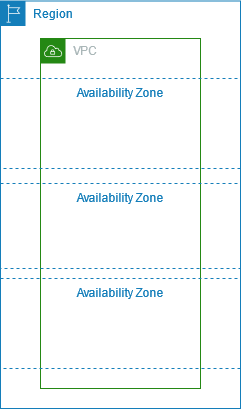

# VPC - virtual private cloud

## Architecture

### Internet Gateway

It's needed for instance to connect outside Internet
and outside internet can connect to instance

### Route Table

live between vpc and subnet, act like a router (of course)

### Network ACL

Network ACL is stateless, it check every packet in and out.
This different from [Security Group](#security-group-sg).

### Subnet

Just like subnet in networking.

### Security Group (SG)

a CIDR (Classless Inter-Domain Routing) define which ip range can access the instance.

SG is statefull, it's mean that if you allow in, block out then if request got in, the response of this request is bypass the security group.

Like a firewall.

## Availability Zone 

- vpc live in region, two vpc in two region can't connect
- vpc contains availability zones
- vpc define an CIDR block, ex: `10.0.0.0/16`

## Subnets

Subnets is subset ip of vpc, ex: if vpc is `10.0.0.0/16`, then subnet can be:

- `10.0.1.0/24`
- `10.0.2.0/24`
- ...

Subnets can live in different availability zones but instances in these subnets can connect to each other. Ex:

- `instance-1` has ip `10.0.1.11` in subnet `10.0.1.0/24` in zone A
- `instance-2` has ip `10.0.2.12` in subnet `10.0.2.0/24` in zone B

These two can ping each other instead of living in different zones

### Config subnet

- `map_public_ip_on_launch` = `false` (default)
  - `true` assign public ip address to instance when created.
  - `false` **not** assign public ip address to newly created instance.
